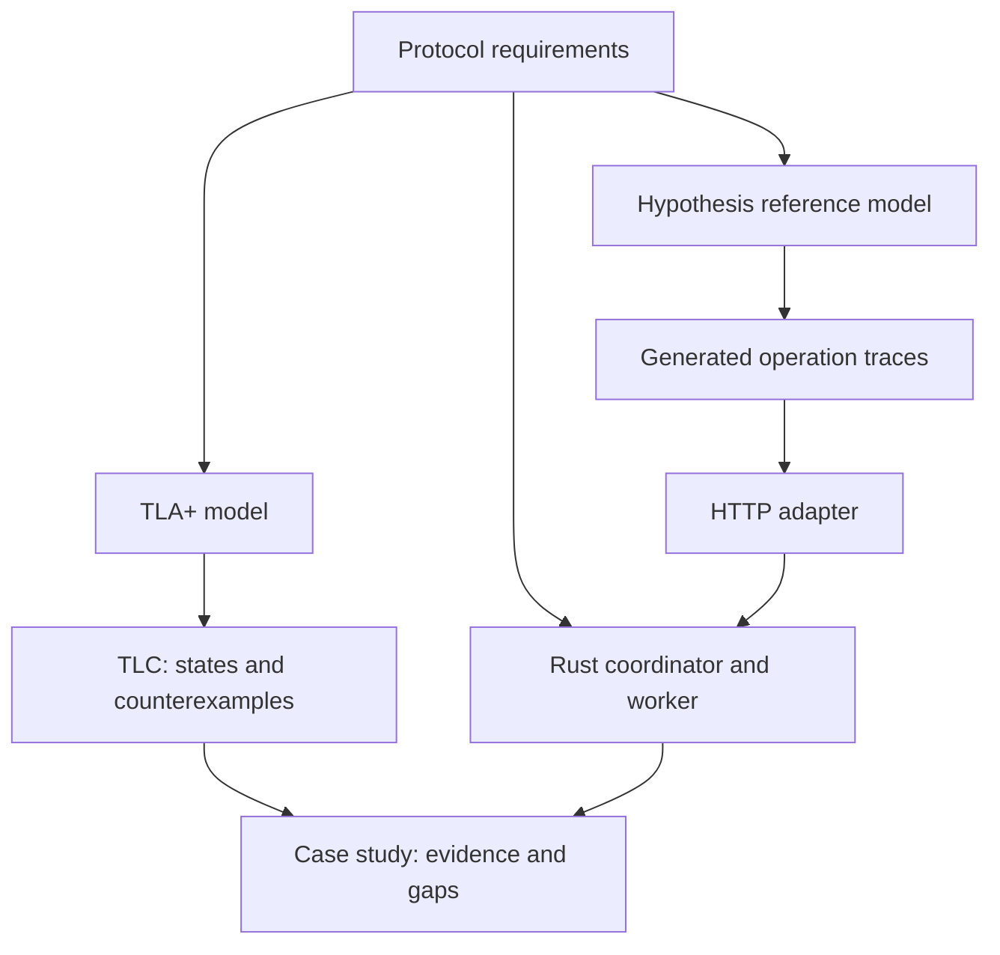
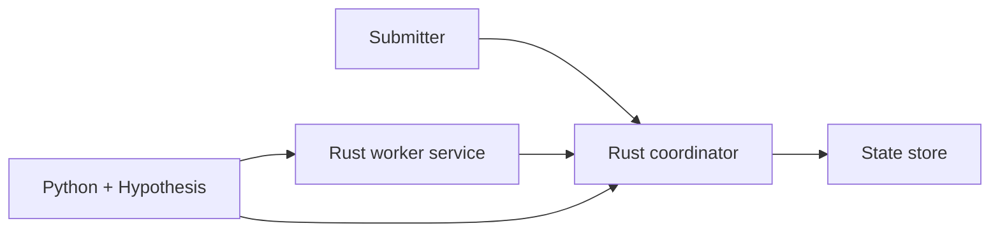
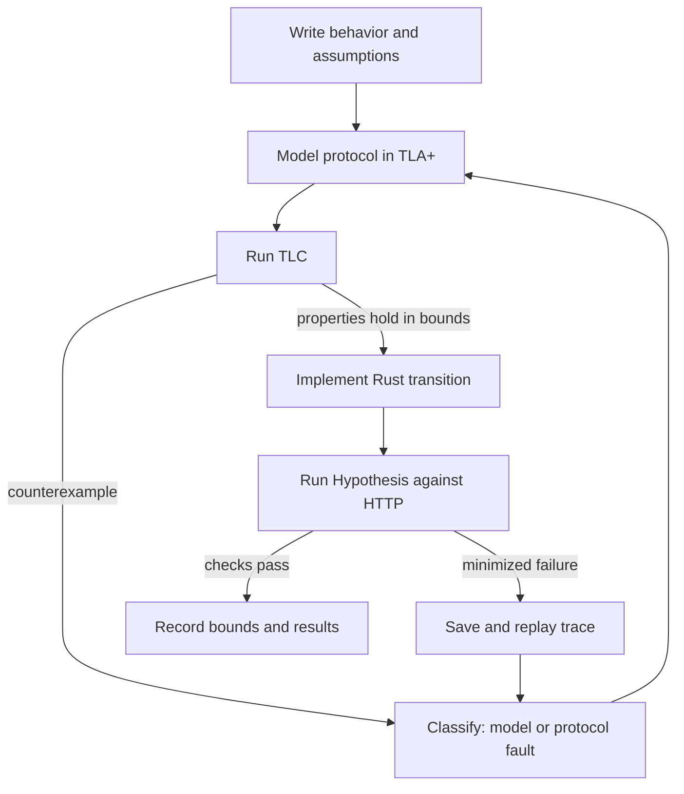

# Verified Scheduler: TLA+, Rust, Hypothesis, and AI

A monorepo learning project for specifying a concurrent job protocol, implementing it as Rust services, and testing the running system from Python. The final deliverable is a reproducible engineering case study, not merely a working scheduler.

## Goals

1. Model a small job scheduling protocol in TLA+ and use TLC to find counterexamples.
2. Implement the protocol in Rust behind a stable HTTP interface.
3. Exercise the running Rust implementation through a Python/Hypothesis black-box harness.
4. Compare guarantees from the abstract model, implementation tests, and generated execution histories.
5. Evaluate AI as an assistant for proposing properties, tests, and explanations; require tool evidence for every correctness claim.
6. Publish a concise account of bugs, counterexamples, fixes, and limitations that a prospective employer can inspect.
7. Turn the strongest discoveries into technical articles on the personal site, with reproducible links back to this repository.

**Timebox:** about 4–6 weeks of part-time work. Each phase has a usable stopping point. Avoid adding infrastructure until it helps test a specific protocol question.

## System and verification flow





At first, run only the coordinator and have the harness act as workers through its API. Add the separate worker process after the lease rules are correct. Begin with in-memory state and a logical clock; add SQLite persistence and restart tests later. A single coordinator is the initial authority for atomic transitions. Multi-coordinator consensus and actual exactly-once execution are outside the first version.

## Protocol contract

### State

- A job has a stable ID, payload, status (`pending`, `leased`, `completed`, `failed`), attempt count, and optional lease.
- A lease identifies a worker, a monotonically increasing **fencing token** for that job, and an expiry in logical time.
- The coordinator tracks the current logical time and an append-only record of accepted terminal commits for diagnostics.
- A worker can be available or crashed. A crash stops that worker from making new requests, but the coordinator learns about it only through explicit test control or lease expiry.

### Operations

| Protocol action | TLA+ transition | Rust HTTP operation | Hypothesis command |
| --- | --- | --- | --- |
| Submit job | `Submit(j)` | `POST /jobs` | `submit(j)` |
| Acquire lease | `Acquire(w, j)` | `POST /workers/{w}/acquire` | `acquire(w)` |
| Complete work | `Complete(w, j, token)` | `POST /jobs/{j}/complete` | `complete(w, j, token)` |
| Advance clock | `Tick` | `POST /test/advance-time` | `advance_time(delta)` |
| Expire lease | `Expire(j)` | coordinator transition after time advance | inspect/trigger expiry |
| Simulate crash | `Crash(w)` | `POST /test/workers/{w}/crash` | `crash(w)` |
| Inspect state | observation | `GET /debug/state` | `state()` |

The test and debug endpoints are enabled only in a dedicated test mode. Define request/response schemas and error codes in `docs/protocol.md`; rejected operations must leave state unchanged. Return the lease token to the acquiring worker and require it on completion. The server decides whether a lease is valid; the client never supplies authoritative time.

### Invariants and their limits

| ID | Property | Meaning |
| --- | --- | --- |
| S1 | Unique accepted commit | Each job has at most one accepted terminal completion. This does **not** mean its work ran only once. |
| S2 | Fenced completion | Only the owner of the current, unexpired lease with the current token can complete a job. |
| S3 | Terminal monotonicity | Completed or permanently failed jobs never return to pending or leased. |
| S4 | Lease uniqueness | A job has at most one current lease in coordinator state. |
| S5 | Retry bound | Attempt count never exceeds the configured maximum; exhausting retries leads to permanent failure. |

Record also the liveness objective **L1: an accepted job eventually becomes completed or permanently failed**, but state its assumptions: clock advances, an eligible worker continues requesting work, operations receive fair scheduling, and a worker eventually completes or exhausts its attempts. TLC may check a bounded version with explicit fairness; a finite test run cannot establish universal liveness. If a job remains leased while time never advances, L1 is not promised.

Start with sequential API operations and test their state transitions. Concurrent HTTP requests and crash/restart behavior come later. If work performs external side effects, fencing at the coordinator alone cannot prevent duplicate external effects; document the need for idempotency or downstream fencing.

## Monorepo layout

```text
verified-scheduler/
├── README.md                         # quick start and results
├── AGENTS.md                         # working rules for Codex
├── docs/
│   ├── protocol.md                   # semantics and API contract
│   ├── traceability.md               # requirement → TLA+ → test mapping
│   ├── decisions/                    # short architecture decisions
│   ├── article-notes/                # evidence and outlines for posts
│   └── case-study.md                 # evidence, measurements, limits
├── spec/
│   └── tla/
│       ├── Scheduler.tla
│       ├── Scheduler.cfg
│       ├── MC.tla                    # optional small model constants
│       └── counterexamples/
├── services/
│   ├── Cargo.toml                     # Rust workspace
│   ├── coordinator/                   # HTTP API and transitions
│   ├── worker/                        # added in a later phase
│   └── scheduler-core/                # pure domain transitions
├── verification/
│   └── python/
│       ├── pyproject.toml
│       ├── scheduler_verification/
│       │   ├── adapter.py            # replaceable interface
│       │   ├── http_adapter.py
│       │   ├── reference_model.py
│       │   ├── strategies.py
│       │   └── traces.py             # serializable replay format
│       └── tests/
│           ├── test_stateful.py
│           └── test_regressions.py
├── experiments/
│   ├── ai-prompts/                    # prompts and model outputs
│   ├── mutations/                     # deliberate protocol faults
│   └── results.md                     # actual observations
└── scripts/
    ├── check-spec.sh
    ├── test-rust.sh
    └── test-system.sh
```

Keep dependencies pinned in the Rust lockfile and Python lock mechanism selected during scaffolding. Record the TLA+ tools version and the exact commands needed to reproduce checks. The top-level README should work from a fresh checkout.

## Harness boundary

The Python harness talks to the Rust service through a narrow adapter. Start with HTTP; a later implementation could expose the same operations through a CLI or another transport.

```python
class SchedulerAdapter(Protocol):
    def reset(self) -> None: ...
    def submit(self, job_id: str, payload: dict) -> dict: ...
    def acquire(self, worker_id: str) -> dict | None: ...
    def complete(self, worker_id: str, job_id: str, token: int) -> dict: ...
    def crash(self, worker_id: str) -> None: ...
    def advance_time(self, delta: int) -> None: ...
    def state(self) -> dict: ...
```

The `reference_model` predicts outcomes for generated commands and checks observable state after each command. Keep its rules simple and independent of Rust internals. Use a fresh isolated server state per Hypothesis example, or start an isolated process; never let examples share state. Capture the seed, minimized trace, service logs, and final state for any failure. A regression test should replay each confirmed failure without relying on Hypothesis to rediscover it.

Example failure trace:

```text
submit(A)
acquire(worker-1)          -> token 1
advance_time(lease_length)
acquire(worker-2)          -> token 2
complete(worker-1, A, 1)  -> must reject without changing state
complete(worker-2, A, 2)  -> may accept
```

Use the same names and argument meanings in TLA+, the trace format, and the HTTP API. An abstract TLA+ action may represent several implementation steps; document every such mismatch in `docs/traceability.md` rather than claiming the model automatically proves the code.

## Milestones and acceptance criteria

### Phase 0 — Scaffold and contract (2–3 sessions)

- Create the monorepo, Rust workspace, Python project, scripts, and starter docs.
- Write the job lifecycle, error responses, lease validity at the exact expiry boundary, token behavior, and retry policy in `docs/protocol.md`.
- Decide whether `now == expiry` is expired; use the same rule everywhere.
- Add a minimal coordinator health endpoint and a harness that can start/reset it.

**Done when:** a fresh checkout can run the coordinator and one Python black-box smoke test; `README.md` contains exact commands.

### Phase 1 — TLA+ first (about 1 week)

- Model a finite set of jobs and workers, logical time, submission, acquisition, completion, expiry, crash, and retries.
- Check type correctness and S1–S5 using TLC with small finite constants.
- Deliberately allow stale completion once; save TLC's shortest practical counterexample, explain it, then restore fencing.
- Add L1 only with explicit fairness/progress assumptions. Record what was and was not checked.

**Done when:** `scripts/check-spec.sh` runs reproducibly and the repository includes a real counterexample and its correction.

### Phase 2 — Rust coordinator (about 1 week)

- Implement domain transitions in `scheduler-core`, then expose them through the coordinator HTTP API.
- Serialize competing state changes so acquisition/expiry/completion are atomic at the coordinator boundary.
- Use an in-memory store and logical time. Reject stale tokens and invalid transitions with distinct responses.
- Add focused Rust tests for transition edge cases; keep black-box behavior as the main acceptance gate.

**Done when:** the recorded stale completion trace is rejected by the running service, and Rust checks pass.

### Phase 3 — Hypothesis state machine (about 1 week)

- Build bounded strategies for jobs, workers, time advances, and operation histories.
- Use `RuleBasedStateMachine` to generate and shrink sequences, including invalid/stale requests.
- Compare responses and snapshots with a small reference model after every action; assert S1–S5 from observable state and the accepted commit log.
- Save minimized failures as JSON traces and replay them in regression tests.

**Done when:** `scripts/test-system.sh` runs against the Rust process, shrinks an intentional fault, and replays its regression.

### Phase 4 — Worker, persistence, and concurrency (1–2 weeks)

- Add a Rust worker process that polls, receives tokens, and reports completion. Keep harness control over its start, stop, and crash behavior.
- Add SQLite persistence with explicit transactions for transitions; test restart recovery and stale workers after restart.
- Add a small number of concurrent request scenarios. Document how the observed histories relate to the sequential reference model; check linearizability only if the harness records enough invocation/response timing to justify that claim.
- Keep deterministic logical-time scenarios as the core suite; run real scheduling stress separately.

**Done when:** crash, expiry, reacquisition, restart, and concurrent acquisition scenarios preserve the safety properties, with repeatable logs.

### Phase 5 — AI experiment and case study (about 1 week)

- Ask an AI assistant to propose invariants and adversarial traces from the written requirements before showing it existing properties.
- Ask it to translate selected properties into candidate TLA+ predicates and Hypothesis rules. Review and run each candidate; mark invalid or vacuous properties.
- Introduce named mutations: remove token validation, permit terminal state reversal, make acquisition non-atomic, and mishandle the expiry boundary.
- Record which checks detect each mutation, the minimized trace/counterexample, time or state-space budget, and false or misleading AI suggestions.
- Write `docs/case-study.md` with the protocol, strongest evidence, missed faults, model/implementation gap, and next steps.

**Done when:** another engineer can reproduce at least two distinct fault discoveries and can tell which findings came from TLC, Rust tests, Hypothesis, and AI proposals.

## Verification workflow



Use this traceability table as a living artifact:

| Requirement | TLA+ predicate/action | Rust behavior | Hypothesis rule/invariant | Evidence |
| --- | --- | --- | --- | --- |
| Current lease owner only can complete | `Complete`, `S2` | completion validates owner, token, expiry | stale-token history | TLC run + minimized HTTP trace |
| Completed job remains terminal | `S3` | transition rejects retry/reacquire | terminal-state check after every step | TLC run + stateful run |

Do not write “verified” without qualification. TLC covers the finite model and its assumptions; Hypothesis samples concrete histories within configured budgets. Save actual tool output and parameters so the claims remain inspectable.

## Working with Codex

Create `AGENTS.md` with these project rules:

1. Read `docs/protocol.md` and `docs/traceability.md` before changing scheduler behavior.
2. Keep the operation vocabulary and expiry boundary consistent across TLA+, Rust, and Python.
3. Make one protocol change at a time. Add or update a counterexample/regression trace when fixing a discovered bug.
4. Run the relevant TLC, Rust, and black-box checks and report their commands and results. Never report a property as proved from passing tests.
5. Treat AI-generated invariants and tests as hypotheses; reject tautologies, unreachable premises, and properties that contradict the contract.
6. Keep failure injection and state introspection restricted to test mode.

Suggested first prompt in the new monorepo:

> Scaffold Phase 0 from this guide. Create the Rust workspace, Python/Hypothesis project, README, AGENTS.md, and `docs/protocol.md`. Implement only a minimal coordinator health endpoint and a Python smoke test that starts an isolated server. In `docs/protocol.md`, make explicit choices for lease expiry (`now >= expiry`), retry limit, and error responses. Show me the resulting file tree, exact commands run, and any unresolved protocol decisions. Do not implement the scheduler transitions yet.

Subsequent prompts should name one phase and one acceptance criterion. For the AI experiment, keep prompts and raw outputs in `experiments/ai-prompts/` so the final comparison can distinguish suggestions from validated findings.

## Publication track

The working destination is your `breynisson.github.io` site at `/Users/bjorgvin/src/breynisson.github.io`. Keep the scheduler monorepo as the source of truth for code, traces, and raw results. Use `docs/article-notes/` for outlines and evidence while work is underway, then write finished posts in the site's existing content format and directory conventions. Inspect that repository before choosing front matter, filenames, or build commands; this guide does not assume a particular static-site generator. The local macOS path is a destination for a later Codex session with access to that machine, not a path this guide needs to create.

| After phase | Article angle | Concrete material to capture |
| --- | --- | --- |
| 1 | **A stale worker breaks my first scheduler model** | Initial protocol, TLC counterexample, fencing-token correction, model bounds |
| 3 | **Using Hypothesis to test a Rust service as a black box** | Adapter design, minimized HTTP trace, replay command, model/implementation gap |
| 4 | **What Rust does and does not guarantee for a leased job** | Concurrent acquisition or restart scenario, transaction boundary, observed result |
| 5 | **Can AI propose useful invariants?** | Exact prompts, accepted/rejected suggestions, mutation results, limitations |

Treat these as possible posts, not a requirement to publish four pieces. One strong article with a real counterexample is better than four progress reports. Draft each from a specific question and surprising observation; include the smallest executable trace, the fix, and the precise scope of the evidence. Avoid publishing claims of exhaustive implementation verification or AI-generated “proofs.”

For each post, keep a compact evidence bundle in the project repository: the relevant commit, TLC configuration and output, a replayable Hypothesis trace if applicable, commands, and versions. Link from the article to those files and from the project README back to the published article. Before publishing, verify that links and diagrams render on the site and that local paths, logs, and prompts contain no private information. Publishing can happen when an article is complete; it need not wait for Phase 5.

Suggested Codex prompt when a milestone produces an article-worthy result:

> Using the evidence from this milestone, outline a technical article for my `breynisson.github.io` site. Lead with the concrete failure, explain the model and implementation only as needed, include reproduction commands and the limits of the result, and link to exact repository artifacts. Draft in `docs/article-notes/` first. Inspect the site repository's conventions before preparing a publishable post there. Do not invent test outcomes or publish the post without my review.

## Portfolio outcome

The finished README should lead with a 30-second overview, a diagram, quick-start commands, a small table of real faults found, and links to published articles. The case study should include one TLA+ counterexample, one minimized Hypothesis trace against Rust, a description of the fixes, and a candid account of what remains unverified. This demonstrates specification work, protocol engineering, language-independent testing, and careful use of AI.
